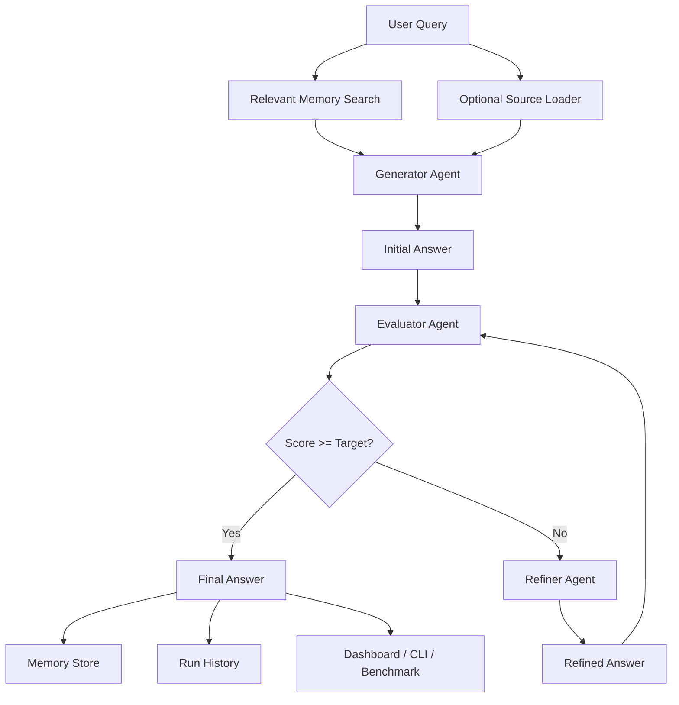

# Aerulias AI Architecture

Aerulias AI is built around a self-improving answer loop. Each component has a clear responsibility, which makes the system easier to explain, test, and extend.

## System Diagram

## Components

### Generator Agent

Creates the first answer. It can use relevant memory and optional source context. When sources are provided, it is instructed to cite claims with source IDs such as `[S1]`.

### Evaluator Agent

Scores the answer from 0 to 100 using:

- Logical correctness
- Completeness
- Clarity
- Hallucination risk

It also returns issues and improvement suggestions.

### Refiner Agent

Improves only the weak parts of the answer. It does not rewrite everything unnecessarily.

### Memory System

Stores useful past mistakes and suggestions. Before a new run, it retrieves only memories that overlap with the current query.

### Source Loader

Loads `.txt` and `.md` files from a file or folder and turns them into citation-ready context.

### Pipeline

Runs the full loop for multiple rounds until the answer reaches the target score or the maximum number of rounds is reached.

## Why This Is Strong

- It uses a multi-agent design.
- It has measurable quality improvement.
- It supports memory.
- It supports cited source-grounded answers.
- It can compare models.
- It has CLI, dashboard, benchmark, tests, and CI.
